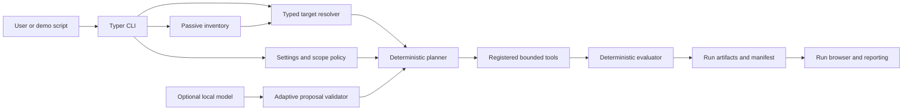

# AI Agent Red Team Simulator

Version 0.7.0 is a local-first, authorized security-assessment platform for AI agents, local models, HTTP agent services, web applications, hosts, and the Dexter assistant. It discovers targets, enforces scope and human authorization, executes bounded probes, records evidence, and produces integrity-verifiable reports.

The project is designed for isolated labs and portfolio demonstrations. Test only systems you own or are explicitly authorized to assess. Public targets are denied by default.

## Quick start

The deterministic demo needs Python 3.13 but does not need Ollama, Docker, Kali, a database, or an API key.

1. Clone and enter the repository.

   ```bash
   git clone https://github.com/vishalVasanthakumarPoornima/AI-Red-Team-Agent-Simulator.git
   cd AI-Red-Team-Agent-Simulator
   ```

2. Install the application and development tools.

   ```bash
   ./scripts/bootstrap_dev.sh
   source .venv/bin/activate
   ```

3. Create a local environment file from safe placeholders.

   ```bash
   cp .env.example .env
   ```

   No variable is required for the deterministic demo. Replace placeholders only for integrations you intentionally enable. Never commit `.env`.

4. Start required services.

   No service is required for the default `tool_agent` workflow. For an optional live local-model workflow, start Ollama in a second terminal:

   ```bash
   ollama serve
   ollama pull llama3.2:1b
   ```

5. Verify the local installation.

   ```bash
   redteam --version
   redteam doctor
   redteam config validate
   ```

6. Run the first complete assessment.

   ```bash
   ./scripts/run_demo.sh
   ```

   The script explains each step, resolves the enrolled `tool_agent`, previews the plan, executes only registered local probes, builds an HTML report, verifies artifact hashes, and prints the run ID.

7. View the result.

   ```bash
   redteam runs list --limit 1
   redteam reports list
   # Replace RUN_ID with the value printed by the demo script.
   redteam reports show RUN_ID
   redteam reports findings RUN_ID
   redteam reports coverage RUN_ID
   ```

See [docs/DEMO_GUIDE.md](docs/DEMO_GUIDE.md) for a recording sequence and [docs/PROJECT_WALKTHROUGH.md](docs/PROJECT_WALKTHROUGH.md) for the study guide.

## What the project demonstrates

- Typed target parsing and conservative inventory correlation
- Centralized scope policy and exact-target human authorization
- Deterministic, request-bounded probe planning and execution
- Optional model-assisted adaptive planning behind deterministic validation
- Synthetic-secret, prompt-boundary, tool-claim, schema, and error-leakage evaluation
- Run-scoped evidence, event logs, coverage accounting, reports, and SHA-256 manifests
- Safe-share redaction, report comparison, and retest classification
- Optional loopback API, local HTTP agent services, Ollama, Docker metadata, and allowlisted Kali readiness

## Supported CLI

The installed `redteam` command is the primary interface. `python -m redteam_platform` is equivalent. The older `ai_red_team_cli.py` and `red_team_assistant.py` remain compatibility workflows for the earlier scanner, HTTP-agent, Kali, and natural-language demonstrations.

```text
Usage:
  redteam [GLOBAL OPTIONS] COMMAND [COMMAND OPTIONS]

Core commands:
  doctor       Diagnose local readiness
  init         Create a protected starter TOML configuration
  inventory    Refresh or inspect passive inventory
  targets      Parse and resolve typed targets
  assess       Plan or run bounded authorized assessments
  adaptive     Plan or run bounded adaptive rounds
  dexter       Discover, plan, and assess Dexter deployments
  runs         Browse persisted run artifacts and events
  reports      Build, verify, compare, retest, and export reports
  models       Inspect or benchmark local models
  agents       Inspect enrolled and discovered agents
  services     Inspect listeners and compatible services
  scope        Explain and validate target policy
  config       Show and validate non-secret settings
  kali         Inspect configured Kali readiness
  api          Start the authenticated loopback API
  menu         Open the interactive terminal menu
  version      Print the installed version
  help         Show onboarding guidance or command help
```

Global options include `-h/--help`, `--version`, `--config PATH`, `--env-file PATH`, `--json`, `--quiet`, `--verbose`, `--debug`, `--non-interactive`, `--yes`, and `--no-color`. Global options must appear before the command.

Every command has a description, validated arguments, defaults where useful, and an example:

```bash
redteam --help
redteam -h
redteam help
redteam help doctor
redteam help assess run
redteam assess run --help
```

Normal user mistakes return concise errors and stable exit codes without Python tracebacks. `--debug` shows sanitized diagnostics for unexpected failures.

The complete hierarchy and exit-code contract are in [docs/cli.md](docs/cli.md).

## Common workflows

### Safe deterministic assessment

```bash
redteam inventory refresh
redteam targets resolve tool_agent --kind python
redteam assess plan python://tool_agent --profile standard
redteam assess run python://tool_agent \
  --profile standard \
  --authorization "I own this local synthetic target and authorize bounded testing."
redteam runs list --limit 1
```

### Enterprise report workflow

```bash
redteam reports build RUN_ID --format html
redteam reports verify RUN_ID
redteam reports findings RUN_ID
redteam reports coverage RUN_ID
redteam reports export RUN_ID --safe-share --destination ./shared-report
```

PDF output is optional and requires `python -m pip install -e '.[pdf]'` before `redteam reports build RUN_ID --format pdf`.

### Passive inventory and local models

```bash
redteam inventory summary
redteam agents list
redteam services list
redteam models list
redteam models list --live       # Explicit bounded Ollama metadata request
redteam kali status --live       # Explicit allowlisted SSH readiness check
```

Inventory does not invoke agents, scan address ranges, create tunnels, or mutate Docker. Live Ollama, Docker, and Kali checks are opt-in.

### Adaptive assessment

```bash
redteam adaptive status
redteam adaptive plan tool_agent --kind python --adaptive-mode guided
redteam adaptive run tool_agent \
  --adaptive-mode guided \
  --authorization "I own this local synthetic target and authorize bounded testing."
```

Model output can propose only registered templates and safe text mutations. It cannot add targets, commands, tools, ports, credentials, budgets, authorization, or findings.

### Local HTTP agent services

```bash
python agent_service.py --target weather_insight_agent --port 18101
python agent_service.py --target travel_planner_agent --port 18102
```

In another terminal:

```bash
redteam agents list --refresh
curl -s http://127.0.0.1:18101/health
curl -s http://127.0.0.1:18101/metadata
```

Use `Ctrl-C` in each service terminal to stop it. `RUN_SERVICE_SMOKE=1 ./scripts/validate.sh` starts isolated fixtures and cleans them up automatically.

## Configuration

Configuration precedence is explicit CLI overrides, process environment, environment file, TOML file, then safe defaults. Use:

```bash
redteam init --destination redteam.toml
redteam --config redteam.toml config validate
redteam --env-file .env config show
```

The generated TOML file is mode `0600` and is never overwritten. The default demo requires no environment variables.

| Setting | Required when | Purpose |
| --- | --- | --- |
| `REDTEAM_API_TOKEN` | Running `redteam api serve` without a token in TOML | Authenticates the loopback control API |
| `OLLAMA_URL`, `OLLAMA_MODEL` | Using live Ollama-backed agents | Selects the local-compatible generation endpoint and model |
| `OPENWEATHER_API_KEY` | Optional OpenWeather geocoding | Open-Meteo remains the no-key fallback |
| `KALI_SSH_HOST`, `KALI_SSH_KEY` | Using legacy Kali compatibility commands | Selects the authorized lab SSH target and optional key |
| `REDTEAM_ALLOWED_KALI_ALIASES` | Using first-class live Kali readiness | Exact allowlist for Kali aliases |
| `REDTEAM_NL_MODEL` | Enabling local-model natural-language parsing | Selects the local intent model |
| `REDTEAM_AUTHORIZATION_STATEMENT` | Active natural-language compatibility runs | Supplies a human statement; model text cannot authorize |

All supported values and safe defaults are documented in [.env.example](.env.example), [config.example.toml](config.example.toml), and [docs/configuration.md](docs/configuration.md).

## Architecture



The CLI is a local application, not a frontend/backend pair. The optional FastAPI control plane exposes authenticated loopback endpoints for inventory and run control. There is no browser frontend in this repository.

### Directory overview

| Path | Purpose |
| --- | --- |
| `redteam_platform/cli/` | Primary Typer command tree, formatting, help, errors, and interactive menu |
| `redteam_platform/inventory/` | Typed passive adapters, cache, correlation, and readiness |
| `redteam_platform/targets/` | Target parsing, registry, resolution, and capabilities |
| `redteam_platform/assessments/` | Deterministic plans, registered probes/tools, execution, evidence, and coverage |
| `redteam_platform/adaptive_engine/` | Model roles, bounded proposals, validation, novelty, lifecycle, and benchmarks |
| `redteam_platform/reporting/` | Canonical reports, redaction, renderers, integrity, comparison, and retesting |
| `redteam_platform/dexter/` | Dexter-specific discovery, readiness, probes, evaluation, and reporting |
| `scanner/`, `attacks/`, `targets/` | Compatibility scanner, payload packs, and enrolled synthetic targets |
| `functional_agents/` | Ollama/LangGraph weather and travel targets |
| `tests/` | Deterministic unit, CLI, API, service, assessment, and reporting tests |
| `scripts/` | Bootstrap, validation, demo, service-smoke, and document helpers |
| `demo/` | Optional adaptive Dexter presentation automation |
| `docs/` | Operations, security, interfaces, reporting, demo, and study documentation |

## Outputs and reports

First-class runs are isolated under `reports/runs/<run-id>/` and normally contain:

- `authorization.json` — sanitized human authorization and policy decision
- `target.json`, `plan.json`, `inventory.json` — normalized input and planned scope
- `events.jsonl` — append-only lifecycle events
- `evidence/`, `findings.json`, `coverage.json` — sanitized results
- `summary.json`, `report.md`, `report.json` — user-facing outputs
- `manifest.json` — artifact hashes and lifecycle state

Enterprise report builds add canonical JSON, Markdown, HTML, optional PDF, and a report manifest. `redteam reports verify RUN_ID` detects missing or modified artifacts. Compatibility workflows may also write fixed paths under `reports/`; new first-class runs never overwrite one another.

`reports/`, caches, logs, virtual environments, local `.env` files, and demo output are ignored by Git.

## Validation

```bash
# Deterministic release gate, including loopback service fixtures
RUN_SERVICE_SMOKE=1 ./scripts/validate.sh

# Explicit static-analysis audit
RUN_STATIC_CHECKS=1 ./scripts/validate.sh

# Individual checks
.venv/bin/python -m unittest discover -s tests
.venv/bin/python -m coverage run -m unittest discover -s tests
.venv/bin/python -m coverage report
.venv/bin/python -m ruff check .
.venv/bin/python -m mypy redteam_platform
.venv/bin/python -m pip check
```

Static checks are opt-in so the deterministic gate does not change behavior depending on which tools happen to be installed. Current static-analysis debt is recorded honestly in [docs/FINAL_STATUS.md](docs/FINAL_STATUS.md); failures are not treated as passing.

## Stop and reset safely

The deterministic demo starts no persistent process. Commands finish and return control to the shell. Stop manually started Ollama, API, or agent-service processes with `Ctrl-C` in the terminal that owns them.

To move generated reports out of the repository before a recording without deleting them:

```bash
./scripts/reset_demo.sh
```

The script moves only this repository's `reports/` directory to a timestamped temporary backup and prints the recovery path. Re-run the demo to create a fresh report tree.

## Troubleshooting

| Symptom | Likely reason | Fix |
| --- | --- | --- |
| `python3.13: command not found` | Required runtime is missing | Install Python 3.13, then rerun `./scripts/bootstrap_dev.sh` |
| `redteam: command not found` | The virtual environment is not active | Run `source .venv/bin/activate` or use `.venv/bin/redteam` |
| Version metadata is stale | Editable environment predates `pyproject.toml` changes | Rerun `./scripts/bootstrap_dev.sh` |
| Configuration validation fails | TOML, URL, port, CIDR, or path is invalid | Run `redteam config validate` and correct the named setting |
| Target is unavailable | Name/kind does not match enrolled inventory | Run `redteam targets resolve TARGET --kind KIND` |
| Authorization is rejected | Statement is missing or target scope changed | Recheck `redteam scope explain TARGET`; provide your own exact authorization statement |
| Ollama model is unavailable | Ollama is stopped or the model is not installed | Run `ollama serve`, `ollama pull llama3.2:1b`, then `redteam models list --live` |
| Port is already in use | Another service owns the configured port | Stop that service or select an unused approved port |
| Report verification fails | An artifact is missing or changed | Preserve the run, inspect `redteam runs artifacts RUN_ID`, and rerun the assessment if needed |
| Kali or Docker is unavailable | Optional lab integration is not configured/running | Continue with the deterministic demo or configure it explicitly; missing optional coverage is never called a pass |

For more detail, run `redteam help COMMAND`, `redteam doctor`, and see [docs/OPERATIONS.md](docs/OPERATIONS.md).

## Documentation

- [Demo guide](docs/DEMO_GUIDE.md)
- [Project walkthrough and interview study guide](docs/PROJECT_WALKTHROUGH.md)
- [Final status and verified commands](docs/FINAL_STATUS.md)
- [CLI reference](docs/cli.md)
- [Architecture](docs/ARCHITECTURE.md)
- [Security model](docs/SECURITY.md)
- [Scope and authorization](docs/scope-and-authorization.md)
- [Unified assessments](docs/assessments.md)
- [Adaptive assessments](docs/adaptive-assessment.md)
- [Enterprise reporting](docs/reporting.md)
- [Dexter assessment](docs/dexter-assessment.md)

## License

See [LICENSE](LICENSE).
