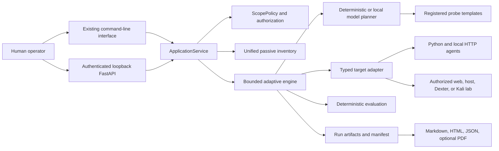
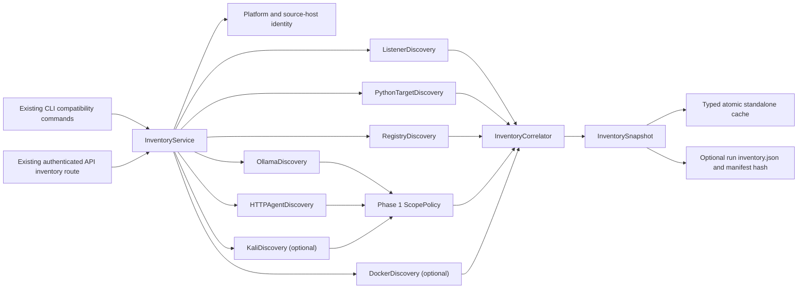

# Architecture

## Application boundaries

`redteam_platform` is the supported application layer. The existing CLI calls
`ApplicationService` directly; FastAPI is optional and delegates to the same
service. `ScopePolicy` is the mandatory authorization boundary before active
work. Adapters receive typed targets and authorization records, then reuse the
existing scanner and deterministic detectors where appropriate.

## Runtime flow

1. `redteam_platform.settings.load_settings` merges TOML, `.env`, process
   environment, and explicit overrides.
2. `ApplicationService.resolve_target` creates an adapter-specific `Target`.
3. `ScopePolicy.authorize` normalizes the destination, resolves every address,
   applies deny rules, and records a human statement.
4. `ApplicationService.run` revalidates authorization immediately before work.
5. The assessment engine executes within explicit budgets and registered
   actions.
6. Only registered probes reach a target adapter; model output cannot add
   tools, destinations, commands, or authorization.
7. `RunArtifacts` sanitizes and persists evidence, findings, reports, and
   hashes under a unique run ID.

Run directories are the durable assessment record; inventory uses a separate
JSON cache. Concurrent API execution uses an in-memory registry, so active task
state does not survive process restart.

## Phase 2 inventory architecture

The inventory subsystem is a library beneath the current application service
and CLI. Adapters return versioned items plus typed errors; they do not print,
persist, or terminate the complete operation. `InventoryService` owns
orchestration, deterministic correlation, stable sorting, summary generation,
cache persistence, and optional Phase 1 run attachment.

## Module responsibilities

- `inventory/models.py`: versioned models, enums, evidence, errors, summaries,
  adapter status, cache metadata, and typed snapshot restoration.
- `inventory/platform.py`: platform detection, URL/address normalization,
  source-host hashing, and deterministic stable identifiers.
- `inventory/listeners.py`: `psutil` collection and safe macOS/Linux fallbacks.
- `inventory/agents.py`: enrolled Python targets, registry records, bounded
  service metadata discovery, and conservative agent classification.
- `inventory/http_probe.py`: scope-checked GET requests, redirect denial,
  response limits, JSON validation, and protected-service handling.
- `inventory/ollama.py`: configured endpoints, version, installed models, and
  running-model metadata.
- `inventory/docker.py`: optional read-only Docker CLI metadata.
- `inventory/kali.py`: exact-alias policy validation and opt-in fixed readiness
  command.
- `inventory/correlation.py`: deterministic deduplication and relationship
  evidence without an LLM.
- `inventory/cache.py`: schema/TTL validation and atomic restrictive writes.
- `inventory/service.py`: partial-failure orchestration, stable output,
  summaries, persistence, and run-manifest registration.

## Trust and dependency direction

Configuration and scope decisions come from Phase 1. Network and SSH adapters
cannot authorize themselves. Python enrollment marks repository code as trusted
for import, but inventory never imports unmarked files and never invokes attack
contracts. HTTP, OpenAPI, Docker, process, and remote Kali output are untrusted
data and are parsed into bounded schemas before use.

Stable IDs are hashes of normalized non-secret identity fields. Timestamps,
credentials, query strings, API keys, and authenticated URL user information
do not participate. Correlation preserves every underlying item and records a
separate reason/confidence relationship rather than destructively collapsing
uncertain identities.
