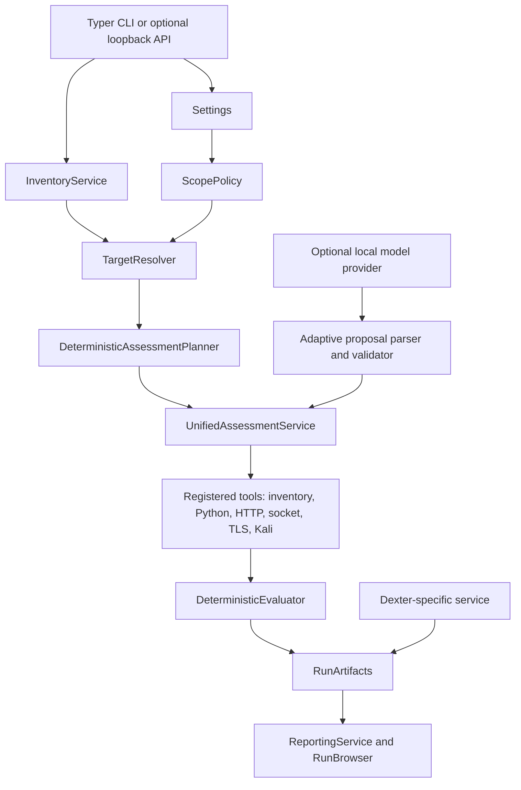
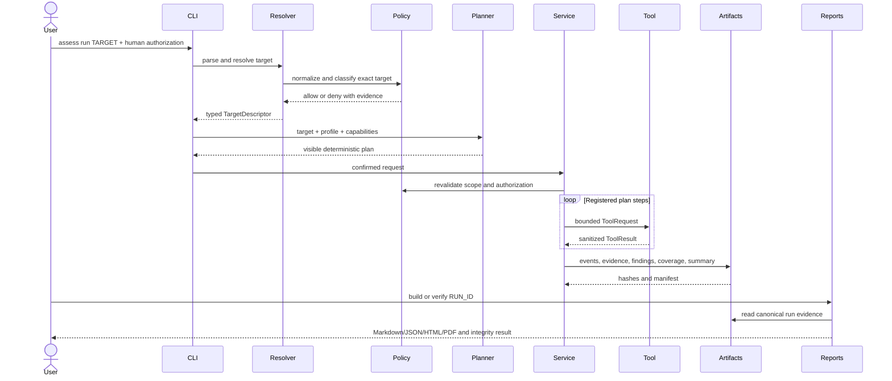

# Project Walkthrough

## Project purpose

AI Agent Red Team Simulator is a local-first platform for evaluating AI agents and their surrounding services under explicit authorization. It solves a practical gap between one-off prompt scripts and an explainable security workflow: targets are discovered and normalized, scope is decided centrally, operations are planned before execution, probes are bounded, evidence is persisted, and reports can be verified and compared.

The core demo is deterministic and offline. Ollama, Dexter, HTTP services, Docker metadata, and Kali are optional extensions rather than hidden prerequisites.

## Problem being solved

A useful AI-agent assessment must answer more than “did a prompt look suspicious?” It must preserve:

- exactly which target was tested;
- who authorized it and for which scope;
- which operations were planned and executed;
- which output created a finding;
- which surface was skipped or unavailable;
- whether saved evidence changed later; and
- how to reproduce, report, and retest the result.

This project models those concerns as typed application services and versioned artifacts.

## High-level architecture

Dependency direction is intentionally inward: interfaces call application services; services call policy, planners, registries, and tools; artifact and reporting layers consume typed results. A model can propose within registered boundaries but cannot become the authority for scope, tools, evaluation, or findings.

## Major components

| Component | Important files and symbols | Responsibility |
| --- | --- | --- |
| CLI | `redteam_platform/cli/app.py::SafeTyperGroup`, `root`, `main` | Command assembly, global options, process boundary, stable errors |
| Help | `redteam_platform/cli/commands/help.py`, `cli/examples.py::apply_help_epilogs` | Generic `help <path>`, onboarding topics, examples for every command |
| Configuration | `redteam_platform/settings.py::Settings`, `load_settings` | Typed defaults, TOML/env precedence, validation, redacted display |
| Scope | `redteam_platform/scope_policy.py::ScopePolicy` | Normalize/classify targets, deny unsafe destinations, bind authorization |
| Inventory | `redteam_platform/inventory/service.py::InventoryService` | Correlate listeners, targets, agents, models, optional Docker/Kali metadata |
| Targets | `redteam_platform/targets/resolver.py::TargetResolver` | Parse a user target and resolve capabilities/health against inventory |
| Planning | `redteam_platform/assessments/planner.py::DeterministicAssessmentPlanner` | Build visible ordered steps from target kind, profile, and capabilities |
| Execution | `redteam_platform/assessments/service.py::UnifiedAssessmentService` | Revalidate scope, execute tools, evaluate evidence, finalize coverage |
| Tools | `redteam_platform/assessments/tools/` | Fixed implementations for inventory, Python, HTTP, socket, TLS, subprocess, Kali |
| Evaluation | `redteam_platform/assessments/evaluation.py` | Deterministic rules that turn observations into outcomes/findings |
| Adaptive engine | `redteam_platform/adaptive_engine/service.py::AdaptiveAssessmentService` | Bounded model roles, proposal validation, novelty, stopping, resume |
| Dexter | `redteam_platform/dexter/` | Specialized discovery, readiness, plans, probes, evidence, and reports |
| Artifacts | `redteam_platform/artifacts.py::RunArtifacts` | Unique directories, atomic writes, restrictive modes, hashes, manifests |
| Reporting | `redteam_platform/reporting/service.py::ReportingService` | Normalize, render, redact, verify, compare, retest, and export |
| Browsing | `redteam_platform/run_browser.py::RunBrowser` | Offline run summaries, events, artifacts, and existing reports |
| Optional API | `redteam_platform/api.py::create_app` | Authenticated loopback control plane and run-status access |
| Legacy scanner | `scanner/attack_runner.py::run_all_attacks`, `scanner/detectors.py::evaluate_response` | Compatibility payload/file scanner and deterministic detectors |
| Target enrollment | `scanner/target_loader.py::discover_targets`, `targets/*` | Literal `REDTEAM_TARGET = True` discovery and `run_agent(prompt)` contract |

Two historical compatibility files, `redteam_platform/cli.py` and `redteam_platform/inventory.py`, remain intentionally. Python imports the package directories (`redteam_platform/cli/` and `redteam_platform/inventory/`) for the supported implementation.

## Data flow

## Control flow

1. `redteam_platform.cli.app.root` builds a `CLIContext` from explicit config and output flags.
2. A command handler validates Click/Typer arguments and selects the application service.
3. `TargetResolver` returns one stable typed descriptor; ambiguity or unsupported kinds fail closed.
4. `ScopePolicy` normalizes the target, classifies addresses/domains, and records why it is allowed or denied.
5. Planning chooses only registered probes compatible with the target kind and assessment profile.
6. Execution requires a human statement for active steps and revalidates scope before tool use.
7. Each registered tool enforces its own bounds and returns a typed status rather than throwing a normal user-facing traceback.
8. Deterministic evaluation creates outcomes and findings from evidence.
9. Coverage counts completed, skipped, unavailable, protected, and failed steps separately.
10. `RunArtifacts` writes atomically into a unique run directory and hashes persisted files.
11. Reporting reads the completed run; it does not change assessment findings to make a report look successful.

## CLI command flow

The installed entry point in `pyproject.toml` maps `redteam` to `redteam_platform.cli:main`. `main` delegates to the Typer application with standalone mode disabled so expected exceptions can be normalized into documented exit codes.

`SafeTyperGroup.invoke` handles four classes of boundary behavior:

- Click usage errors remain exit code 2 and include usage guidance.
- Domain errors become sanitized human panels or JSON error envelopes.
- interrupts return the dedicated interrupted code without a traceback.
- unexpected errors show a sanitized traceback only in `--debug` mode.

`redteam help GROUP COMMAND` traverses the same Click command tree used by `--help`, so duplicate hand-written command documentation cannot drift.

## Backend and API flow

The local CLI is the primary application. The optional FastAPI backend is created by `redteam_platform.api.create_app` and is bound to loopback only by CLI policy. It requires `REDTEAM_API_TOKEN`, validates request size/rate limits, and uses the same settings, scope, inventory, assessment, and artifact services as the CLI.

The API is a control plane, not a separate implementation. This avoids CLI/API schema drift and keeps authorization decisions in one place.

## Frontend flow

There is no browser frontend in this repository. Human presentation is provided by Rich terminal views plus generated Markdown, HTML, PDF, and safe-share reports. Dexter's own dashboard is an external assessment target, not this project's UI.

That distinction is useful in a demo: the project focuses on backend security workflow, reproducible evidence, and reporting instead of adding a low-value dashboard late in development.

## Model and agent orchestration

There are three model-related paths:

1. Enrolled Python targets expose `run_agent(prompt)`. The deterministic `tool_agent` works offline; Ollama-backed targets use `OLLAMA_URL` and `OLLAMA_MODEL`.
2. Functional weather/travel targets use LangGraph orchestration and guarded deterministic fallback text when a small local model refuses or fails.
3. The adaptive engine assigns explicit planner/mutator/summarizer/reviewer roles to local providers. Provider output is parsed into strict models, checked against an immutable target/authorization/configuration, and either accepted as a registered probe proposal or recorded as rejected.

The model never decides whether a target is authorized, never creates arbitrary shell commands, and never directly declares a finding. Deterministic code owns those decisions.

## Storage and memory flow

There is no application database or vector database requirement.

- Inventory cache: `reports/cache/inventory.json`, atomic and TTL-aware.
- First-class runs: `reports/runs/<run-id>/`, unique and append/persist oriented.
- Event stream: `events.jsonl`, one sanitized record per lifecycle event.
- Evidence: content-addressed files and references under the run directory.
- Manifests: SHA-256 records used by `redteam reports verify`.
- Adaptive benchmarks: separate `reports/benchmarks/` tree.
- Compatibility reports: older fixed paths under `reports/` retained for earlier workflows.

“Memory” probes in Dexter assess the configured external Dexter memory boundary with synthetic markers. They do not make this project depend on a vector store.

## Security boundaries

- Public targets are denied by default.
- Loopback is the default allowed network scope; private/public expansion must be explicit.
- Credential-bearing URLs, metadata IPs, link-local, multicast, unspecified, and unsafe schemes fail closed.
- Active assessment requires a human statement tied to the normalized target.
- `--yes` confirms eligible UI prompts but never invents authorization.
- Inventory is passive by default; live integration checks are explicit.
- Tools are registered and bounded by ports, paths, requests, timeouts, response bytes, and concurrency.
- Kali subprocess arguments are allowlisted and never use arbitrary `shell=True` command text in the first-class path.
- Evidence and error output are sanitized; config display never reveals token/key values.
- Run directories and files use restrictive POSIX modes where supported.
- Reports expose coverage gaps rather than reclassifying missing evidence as a pass.

See `docs/SECURITY.md` and `docs/scope-and-authorization.md` for the detailed threat model.

## Important design decisions

### Local-first deterministic baseline

Reason: a portfolio demo must succeed without cloud credentials or a remote lab. Optional model/Kali paths add depth without becoming a single point of failure.

### Typed schemas at boundaries

Reason: scanners, adapters, evaluators, and reporters otherwise drift into incompatible dictionaries. Versioned Pydantic models make persistence and compatibility explicit.

### Plan before execute

Reason: security tools need reviewable scope, operations, budgets, and skip conditions. A plan command has no run side effects.

### Models as untrusted proposal sources

Reason: adaptive behavior is useful, but model text cannot safely own authorization, tool selection, budgets, or detector truth.

### Run-scoped immutable-style evidence

Reason: fixed report paths overwrite history and weaken explanation. Unique IDs plus hashes make comparison and retesting credible.

### Specialized Dexter workflow plus generic platform

Reason: Dexter has memory/retrieval/tool-specific capabilities worth testing, while generic Python/HTTP/Ollama/host/web targets benefit from one shared planner and tool layer.

### Preserve compatibility workflows

Reason: the older scanner, natural-language assistant, and Kali demos contain portfolio history and useful targeted flows. The README labels the new CLI as primary instead of deleting working behavior.

## Known limitations

- MyPy has known baseline errors across several legacy/current type boundaries; runtime tests remain authoritative until that debt is resolved.
- Ruff finds legacy style/import issues outside the files changed in the final readiness pass.
- Live Ollama, Docker, Dexter, weather-provider, Render, and Kali behavior depends on external local/lab state and is not part of the offline guarantee.
- Python targets are trusted in-process modules, not sandboxed untrusted code.
- The stdlib compatibility agent services are demo services, not internet-facing production servers.
- PDF generation is optional and requires the `pdf` extra.
- No browser frontend, database, CI workflow, or public hosted deployment is required for the final local portfolio path.

Exact verified counts and commands belong in `docs/FINAL_STATUS.md`, which is updated from the final validation run rather than inferred here.

## Likely technical interview questions

### Why not let the LLM choose tools and findings directly?

Because an assessment model is untrusted input. The platform permits models to propose within a typed registry, then deterministic policy validates scope, operation, budget, and evidence. Findings come from deterministic evaluators so the result is reproducible and auditable.

### How do you prevent accidental unauthorized scanning?

Targets are normalized and classified by one `ScopePolicy`; public and unsafe address classes fail closed; active commands require a human statement; execution revalidates the exact target; and tools enforce their own path/port/request bounds.

### What makes a run reproducible?

The run stores the typed target, authorization decision, plan, probe definitions, results, evidence, coverage, versions, events, and hashes in a unique directory. Reports and comparisons consume those artifacts rather than recomputing hidden state.

### What does 100% coverage mean here?

It means all planned applicable steps were exercised. It does not mean the target is 100% secure. Skipped, unavailable, protected, and failed steps remain visible and reduce or qualify coverage.

### Why use both generic and Dexter-specific assessment code?

The generic layer handles shared target kinds and tools. Dexter has domain-specific memory, retrieval, fake-tool, voice, and service relationships that deserve explicit readiness, probes, and coverage rather than being flattened into generic HTTP checks.

### Why no database?

The portfolio workflow is local and run-scoped. Atomic JSON/text artifacts are transparent, easy to inspect, hash, copy, and compare. A database would add operational complexity without improving the current bounded single-user use case.

### How are normal CLI errors different from bugs?

Invalid usage and expected domain failures map to stable exit codes and actionable messages without tracebacks. Unexpected exceptions are sanitized by default and expose diagnostic detail only with `--debug`.

### What would you build next if this became a multi-user service?

Separate workers, authenticated authorization ownership, a durable database/object store, process-isolated target runners, queue/backpressure controls, secrets management, audit identities, deployment tests, and CI quality/security gates. Those are intentionally outside the final local portfolio scope.

## Recommended study order

1. `README.md` and `docs/DEMO_GUIDE.md` — learn the user promise and demo path.
2. `redteam_platform/cli/app.py`, `cli/commands/help.py`, and `cli/commands/assess.py` — trace command dispatch and errors.
3. `redteam_platform/settings.py` and `scope_policy.py` — understand configuration and trust boundaries.
4. `redteam_platform/inventory/models.py` and `inventory/service.py` — learn discovery types and correlation.
5. `redteam_platform/targets/models.py`, `parser.py`, and `resolver.py` — follow normalization to capabilities.
6. `redteam_platform/assessments/planner.py`, `probes/packs.py`, and `tools/` — inspect deterministic plans and operations.
7. `redteam_platform/assessments/service.py`, `evaluation.py`, and `coverage.py` — follow execution to findings.
8. `redteam_platform/artifacts.py`, `run_browser.py`, and `reporting/` — study persistence, integrity, and presentation.
9. `redteam_platform/adaptive_engine/` — understand how model proposals remain bounded.
10. `redteam_platform/dexter/` — study the specialized integration after the generic flow is clear.
11. `tests/test_phase5_unified.py`, `test_phase6_adaptive.py`, and `test_phase7_reporting.py` — use tests as executable specifications.
12. Compatibility paths (`ai_red_team_cli.py`, `red_team_assistant.py`, `scanner/`, `kali_*`) — learn the project's evolution last.
