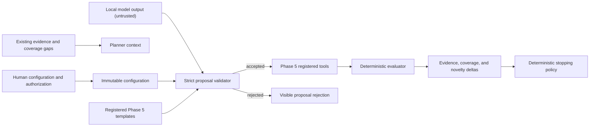

# Adaptive assessment

Phase 6 adds a bounded adaptive layer to the Phase 5 assessment lifecycle. It
supports enrolled Python agents, configured HTTP/OpenAI-compatible agents,
Ollama endpoints and agents, and first-class Dexter deployments. Generic host,
IP, website, and web-application targets remain deterministic unless a future
adapter explicitly declares safe adaptive capabilities.

## Modes

| Mode | Model authority | Behavior |
| --- | --- | --- |
| `off` | None | Phase 5 deterministic assessment only. |
| `guided` | None | Deterministic hypotheses select registered Phase 5 templates. |
| `adaptive` | Proposal only | One explicitly selected local model may propose registered templates and safe textual mutations. |
| `comparative` | Proposal only | At least two explicitly selected models are recorded for comparison; the same validators remain authoritative. |

The standard profile defaults to `off`; invoking `adaptive plan` defaults to
`guided`. Passive profiles cannot execute adaptive probes. Deep-lab remains
loopback/lab-only and requires real interactive confirmation. `--yes` cannot
enable or confirm adaptive or deep-lab execution.

```bash
redteam adaptive status
redteam adaptive plan tool_agent --kind python --adaptive-mode guided
redteam adaptive run tool_agent \
  --kind python \
  --adaptive-mode guided \
  --authorization "I own this local synthetic target and authorize bounded testing."
```

## Trust boundary



A model may rank registered templates, propose safe textual mutations,
summarize evidence, explain a choice, or recommend stopping. It cannot change
authorization, target identity, destination, ports, paths, profile, budgets,
tools, operations, credentials, provider state, detector outcomes, findings,
or errors. Raw model text is never executed.

Proposals are rejected on schema, template, category, adapter capability,
scope, authorization, operation, tool, request budget, prompt length,
mutation-safety, evidence, hypothesis, and duplicate checks. Rejections are
durable assessment records, not hidden planner failures.

## Budgets and stopping

The maximum configurable defaults are eight rounds, 100 total probes, 15
probes per round, 25 model calls, and 20 minutes. Standard mode is capped more
conservatively at four rounds, 40 probes, eight probes per round, 12 model
calls, and ten minutes.

Stopping is deterministic. Reasons include cancellation, human stop request,
target/provider unavailable, maximum rounds, probe/model-call/time budget,
repeated lack of useful novelty, duplicate-rate threshold, and saturated
coverage. A model stop recommendation is accepted only when deterministic
coverage state independently agrees.

Novelty does not require embeddings. It uses template ID, normalized prompt
hash, lineage, word/sequence similarity, categories, outcomes, evidence
deltas, and coverage deltas. A cosmetic paraphrase is not useful novelty.

## Resume and cancellation

`redteam adaptive resume RUN_ID` verifies the existing manifest, target
identity, normalized scope, adapter compatibility, configured model
availability, preserved counters, and fresh human authorization. It reuses the
same run directory and executed prompt hashes. Schema, target, scope, or
manifest drift fails closed. `redteam adaptive stop RUN_ID` writes a durable
human stop request checked at the next lifecycle boundary.

Each Phase 5 run gains:

- `adaptive_configuration.json`
- `model_roles.json`
- `adaptive_state.json`
- `hypotheses.json`
- `adaptive_rounds.json`
- `proposal_rejections.json`
- `novelty.json`
- `stop_decision.json`
- `adaptive_summary.json`
- optional `adaptive/round-NN/round.json` records

Invalid provider output is sanitized and retained in
`provider_responses.json`; repair attempts count against the model-call
budget. Interruptions persist state and a final stop decision.
