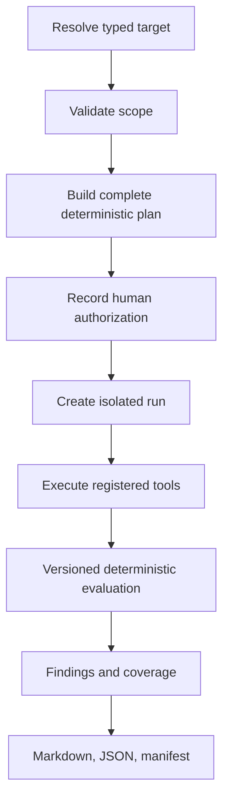

# Deterministic assessments

The common engine produces the complete plan before execution and never adds
hidden steps. Registered probe packs cover AI behavior, HTTP/API metadata and
inputs, web security observations, TLS, explicit host ports, and optional
single-host Kali validation.

Profiles are `passive`, `standard`, and `deep-lab`. Passive uses GET/metadata
and configuration evidence. Standard enables bounded active probes. Deep-lab
expands fixed checks only for loopback/configured lab targets and requires a
final interactive confirmation. Global and per-profile request/time budgets
are hard caps.

Coverage records completed, skipped, failed, protected, unavailable, and
timeout states independently. Missing evidence is never described as secure.
Cancellation stops future steps, calls tool cleanup, preserves completed
evidence, and finalizes the run as cancelled.
