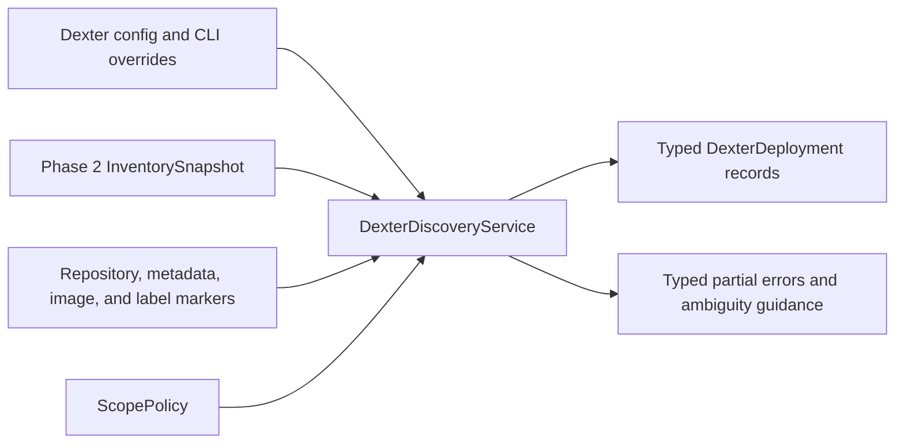
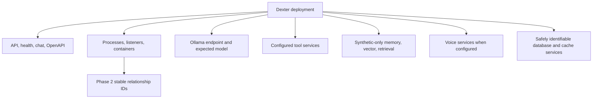
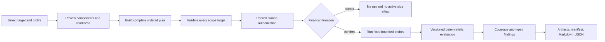
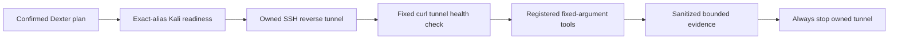
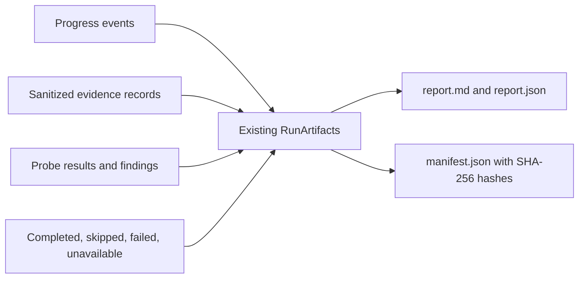

# Dexter assessment

Phase 4 makes Dexter a first-class, versioned target with dedicated discovery,
readiness, deterministic planning, execution, coverage, artifacts, and reports.
The workflow is local-first and does not require the optional FastAPI platform.

## Supported deployments and discovery

Dexter can be represented as an enrolled Python target, local FastAPI or
compatible HTTP service, Docker container, related multi-process deployment,
configured private lab service, or a deployment associated with Ollama and
supporting tool, memory, vector, retrieval, voice, database, or cache services.
Multiple deployments may be configured. Generic FastAPI evidence alone is
never enough to classify a service as Dexter.

Explicit configuration has the highest confidence. Phase 2 inventory supplies
process, listener, service, agent, container, and Ollama evidence. Automatic
classification requires project-specific Dexter names, markers, metadata,
images, or labels. Stable IDs and inventory relationship IDs remain visible.





## Readiness

`redteam dexter health DEXTER_ID` performs bounded GET-only checks against
configured routes. It sends no prompts. Component states distinguish ready,
degraded, protected, unavailable, not configured, and unknown. Ollama readiness
distinguishes installed from loaded models. Missing optional components reduce
available coverage without pretending that they are secure.

## Profiles and deterministic plan

- `passive`: inventory, readiness, metadata, OpenAPI, headers, service exposure,
  and reports. No attack prompts.
- `standard`: bounded AI, API, tool, memory, retrieval, rate-limit, evaluation,
  artifact, and optional Kali steps.
- `deep-lab`: expanded fixed probes only for loopback or configured lab scope.
  It requires interactive human confirmation and cannot be enabled by `--yes`.



The plan lists every phase, mode, category, operation, request limit, timeout,
tool, scope target, authorization requirement, skip condition, and evidence
type. Execution cannot add hidden steps. Models cannot change scope,
authorization, commands, probe templates, or budgets.

## Probe and data boundaries

AI probes use synthetic prompts and canaries for prompt disclosure,
instruction hierarchy, synthetic-secret reflection, tool claims, schema/error
behavior, refusal behavior, and bounded resource requests. API probes use GET,
OPTIONS, and conservative POST inputs; there is no brute force, recursive
crawl, uncontrolled fuzzing, or denial of service.

Tool probes mention fake/dry-run tools only. The platform never converts model
text into a shell command. Memory tests write only when a disposable namespace
is explicitly configured; otherwise they use a read-only isolation question.
Retrieval uses an inline local synthetic marker. Real conversations, stored
user data, credentials, and non-test records are outside the workflow.

## Optional Kali path

Kali is disabled unless `--include-kali` is selected and the exact configured
SSH alias is allowed. Readiness runs before any tool. The adapter uses fixed
argument arrays for registered `nmap`, `whatweb`, and `curl` checks, verifies an
owned reverse tunnel before use, caps output and time, and tears the tunnel
down in `finally`. Kali absence or timeout becomes unavailable coverage, not a
failed whole assessment.



## Artifacts, findings, and coverage

Each confirmed run creates `reports/runs/<run_id>/` only after final
confirmation. It contains authorization, inventory, target, readiness, plan,
events, probe results, typed deduplicated findings, coverage, evidence,
Markdown/JSON reports, summary, and a hashed manifest. JSON writes are atomic,
paths are contained, permissions are restrictive where supported, and
persisted values are sanitized.



Coverage is calculated from planned steps. Skipped, failed, unavailable, or
unattempted work cannot become a passing security claim. Findings distinguish
confirmed, likely, informational, unverified, not applicable, and coverage
error states and include evidence references, confidence, impact, root cause,
remediation, standards mapping, and retest guidance.

## Safe examples and limitations

```bash
redteam dexter discover
redteam dexter list --json
redteam dexter health DEXTER_ID
redteam dexter plan DEXTER_ID --profile standard
redteam dexter assess DEXTER_ID \
  --profile standard \
  --authorization "I own this local Dexter lab and authorize bounded testing."
```

Group-level CLI overrides are placed before the subcommand:

```bash
redteam dexter \
  --endpoint http://127.0.0.1:8000 \
  --health-route /status \
  discover
```

Live Dexter, Docker, Ollama, and Kali validation remains opt-in.
Authentication values must be supplied by a separately controlled integration;
Dexter configuration stores only a safe reference. Automatic discovery is
deliberately conservative. The optional API remains a loopback control plane;
the repository does not claim a public multi-user deployment.
