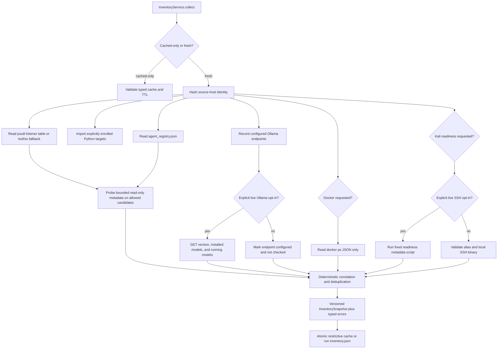

# Passive Inventory and Discovery

Phase 2 provides one typed, local-first inventory snapshot for later CLI and API
consumers. The implementation is under `redteam_platform/inventory/`, and
`InventoryService.collect` is the supported orchestration entry point.

## Safety boundary

Inventory is passive-first. It reads the host's existing listener table and
only probes explicitly configured endpoints, registered agent endpoints, or
known project ports that are already listening. It does not scan address
ranges, enumerate arbitrary ports, send assessment prompts, call `/invoke`,
load or run models, mutate containers, start tunnels, or execute
model-generated commands.

Every HTTP request is checked by the Phase 1 `ScopePolicy`. Redirects are not
followed. Metadata requests have short timeouts and response-size limits.
Ollama HTTP checks and Kali SSH readiness are separate explicit opt-ins.
Persisted snapshots pass through the Phase 1 sanitizer.

## Discovery flow



## What is discovered

- Ollama endpoints are normalized and scope-checked. A live check reports
  version, latency, installed models from `/api/tags`, and loaded models from
  `/api/ps`. Installed and running are independent model states.
- Python targets are limited to repository files returned by the existing
  literal `REDTEAM_TARGET = True` enrollment discovery. Inventory checks the
  callable contract but never invokes an assessment prompt.
- HTTP candidates come from configuration, `agent_registry.json`, or an
  already-listening known project port. `/health`, `/metadata`, `/targets`,
  `/openapi.json`, and `/v1/models` are GET-only metadata routes.
- HTTP evidence can confirm the project agent service, the multi-agent lab,
  an OpenAI-compatible endpoint, an Ollama endpoint, or a FastAPI application.
  A listener without agent-specific evidence remains a generic service.
- Listener discovery supports macOS and Linux through `psutil`, with `lsof`
  and `ss` fallbacks. TCP is enabled by default; UDP is configurable.
- Docker is optional and uses `docker ps --format "{{json .}}"`; it never
  starts, stops, inspects, executes in, or pulls a container.
- Kali reports not configured, denied, locally ready for an opt-in check, or
  the result of a fixed allowlisted readiness command. It never scans a target.

## Confidence, health, and errors

`discovery_confidence` distinguishes `confirmed`, `high`, `medium`, `low`, and
`unknown`. A separate `confidence_reason` and typed evidence list explain each
classification. Health and availability remain separate from discovery
confidence. A 401 or 403 confirms a protected service exists but does not
classify it as an agent. Adapter failures are retained as typed errors and do
not invalidate otherwise useful inventory.

Correlation uses exact normalized endpoints, host-network listener addresses
and ports, explicit registry/service references, Python target names, Ollama
endpoint identities, and Docker host-port mappings. Ambiguous candidates are
not merged, and equal port numbers in different network namespaces are not
treated as the same service.

## Cache and run artifacts

The standalone cache defaults to `reports/cache/inventory.json`. It is
schema-validated, TTL-aware, atomically replaced, marked stale when expired,
and written with mode `0600` where supported. An incompatible or corrupt cache
is reported rather than silently reused.

`InventoryService.attach_to_run` can write
`reports/runs/<run_id>/inventory.json`, hash it, and register it in the Phase 1
manifest. Existing inventory artifacts are preserved unless the caller
explicitly requests overwrite for the same active run.

## Safe commands

```bash
redteam inventory summary
redteam inventory show --loopback
redteam inventory refresh
redteam models list
redteam models running
redteam agents list
redteam services list
redteam services listeners

# Phase 2 compatibility shapes
redteam inventory --json
redteam inventory --json --refresh
redteam inventory --json --cached
redteam models --json
redteam agents --json
redteam services --json
redteam kali-status --json
```

The nested Phase 3 data commands return the documented JSON envelope. The five
compatibility commands above deliberately keep the Phase 2 raw payload shape.

Optional local checks:

```bash
# Makes bounded GET requests only to configured, policy-approved Ollama endpoints.
redteam models --json --live

# Reads Docker metadata only.
redteam inventory --json --include-docker

# Validates Kali configuration without connecting.
redteam inventory --json --include-kali

# Makes one bounded readiness connection to an explicitly allowlisted SSH alias.
redteam kali-status --json --live
```

## Known limitations

- Process metadata can be missing when the operating system denies access.
- Wildcard listeners are clearly marked, but reachability still depends on
  firewall, routing, namespaces, and container networking.
- Native fallback parsers provide less process detail than `psutil`.
- HTTP classification is evidence-based and intentionally conservative.
- Docker correlation is based on reported host ports; it does not enter
  container namespaces.
- Kali reverse-tunnel capability remains unknown unless a future explicit,
  non-mutating capability check can establish it safely.
- The configured listener cache TTL is reserved for per-adapter caching; Phase
  2 persists the complete snapshot using the inventory cache TTL.
