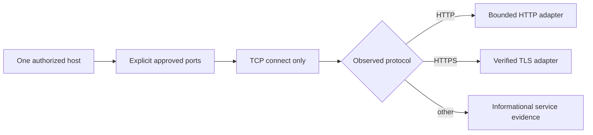

# Host and IP assessment

Host assessment is limited to one exact hostname or IPv4/IPv6 address and an
explicit list of at most 64 ports. The default list is visible in the plan.
There are no address ranges, full-port scans, credential attempts, payload
sends, UDP sweeps, or aggressive scripts. Socket checks distinguish open,
closed/filtered, timeout, and unavailable.



```bash
redteam assess host 127.0.0.1 --port 8000 \
  --authorization "I own this local host and authorize bounded testing."
```

`--include-kali` is explicit opt-in. It uses one fixed `nmap -sT -Pn` command
through a configured allowlisted SSH alias and the exact plan ports.
