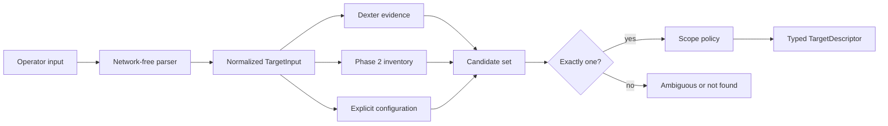

# Unified targets

Phase 5 resolves Python agents, HTTP agents, OpenAI-compatible endpoints,
Ollama endpoints and agents, Dexter, hosts/IPs, websites/web applications, and
local services into one versioned `TargetDescriptor`.

Parsing is network-free. It normalizes Python URIs, HTTP(S), IPv4, bracketed
IPv6, hostnames, explicit ports, and stable inventory IDs. Credential-bearing
URLs, queries/fragments, malformed ports, and unsupported schemes are rejected.
Unknown simple names are not guessed. Resolution then uses specialized Dexter
evidence, Phase 2 inventory, explicit configuration, and finally conservative
operator input. Multiple matches return candidates and require a stable ID.



Useful commands:

```bash
redteam targets parse tool_agent
redteam targets resolve python_target_abc123
redteam targets show http://127.0.0.1:8000 --kind web_application
redteam targets capabilities tool_agent
redteam targets health tool_agent
```
